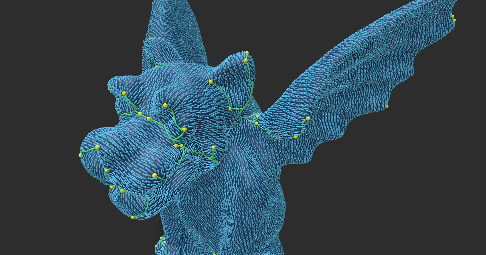

# nvec -- Tiny poly vectorfield library  

nvec is header only tiny vectorfield library suppoting rosy, combed, global optimal directional field.
The solver supports both Eigen LLT and suitesparse cholmod, automatically selected in cmake findpackage.

This library is still under alpha development. 
Documents for the basic properties will be added soon.

